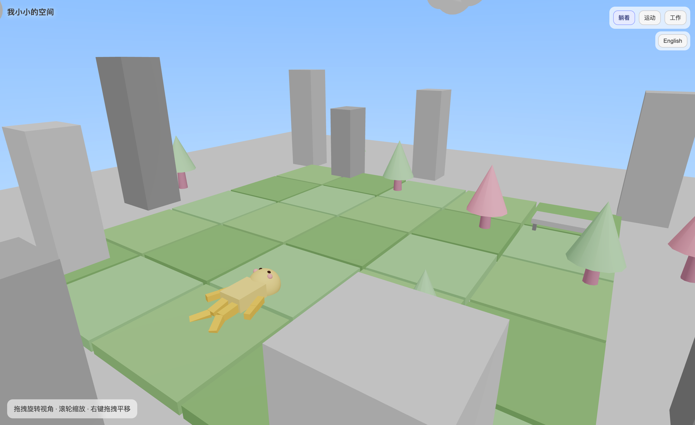
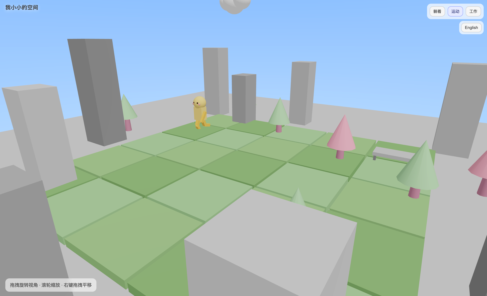
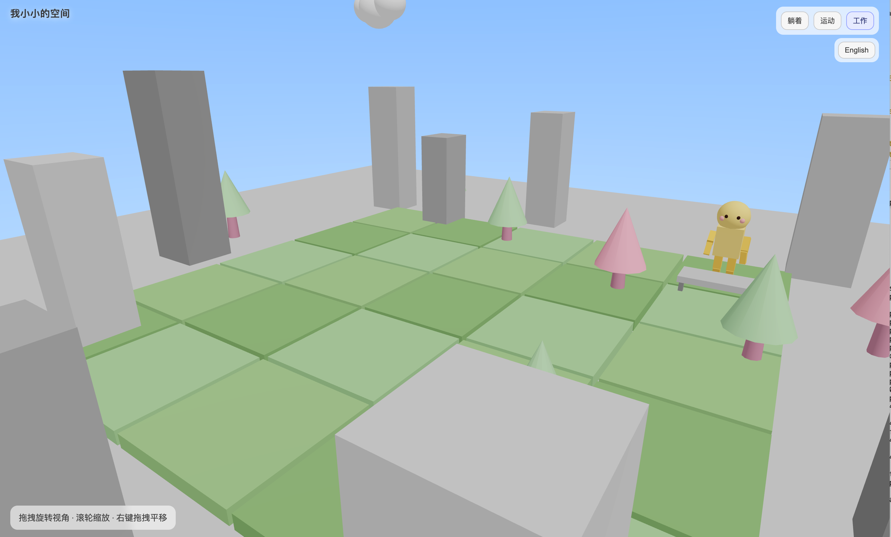

# 我小小的空间 My Tiny Space 

这是一个小小的空间，小人可以自由自在地躺着、运动或者工作。 This is My Tiny Space where the little character can lie down, move around or work freely.

每到整点，小人会切换动作，用户也可以手动临时切换。 Every hour the character will switch its actions, which can also be manually switched temporarily.

电脑端手机端均可访问~ It can be accessed both on computers and mobile device.







## 长期部署 For deploy

可以通过caddy部署。（测试机器：Ubuntu）

```bash
sudo apt update
sudo apt install -y caddy
sudo tee /etc/caddy/Caddyfile > /dev/null <<'EOF'
:5321 {
  root * /your/path/to/my_tiny_space
  file_server
}
EOF
sudo systemctl start caddy
sudo systemctl enable caddy
```

然后访问 `http://localhost:5321/index.html`

## 开发时的测试 For dev

```bash
python3 -m http.server 5321
```

然后访问 `http://localhost:5321/index.html`